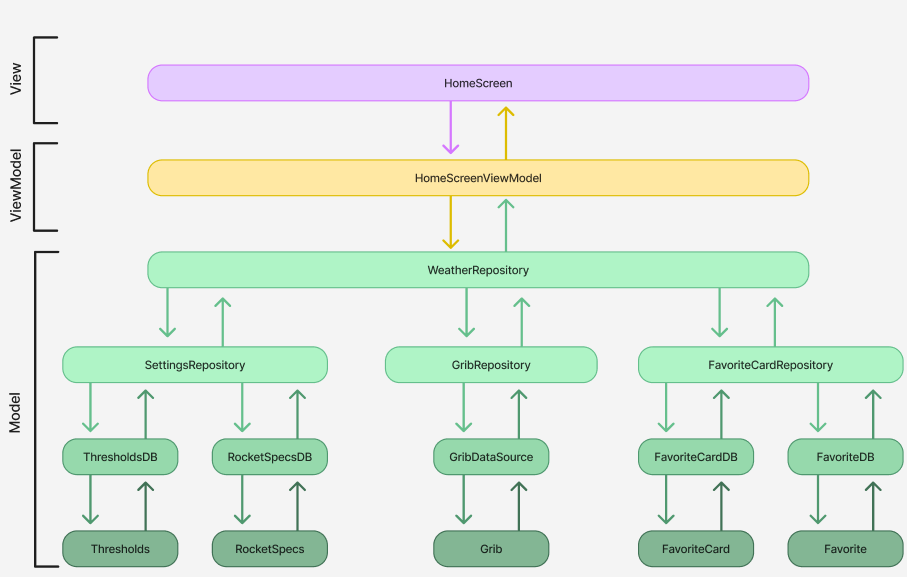
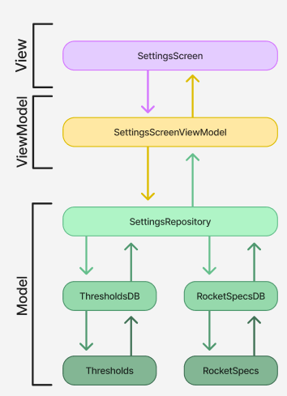

# 1 MVVM

MVVM, known as Model-View-ViewModel, is a design pattern used in software engineering, often found in applications with a user interface. Model refers to the data itself, and handles data from databases, websites or other sources, and can also contain the logic to manipulate this data.

The View is where the user interacts with the application. It lets the user see data from the model, but also lets them input data to the application. It could be a window, a page or other elements, depending on the platform and the technologies used.
                                                        
The ViewModel is the connective tissue between the Model and the View. The ViewModel is an abstraction of what is being shown, and also contains logic for presentation. It receives data from the model, formats it into a way that is more suited for visual presentation, and gives methods and abilities that the view can bind to. It also allows for the View to send requests, and change data in the Model-layer.

\
Our application has gained a lot of benefits from choosing the MVVM-approach. Separating the code into different parts (model, view, viewmodel), making it more organised and easier to maintain. Splitting our code into smaller parts, it also makes testing each part more accessible. By using the ViewModel layer, the presentation logic can be reused across different views, which reduces duplication and makes the interface easier to use. Lastly the MVVM-model makes scaling the application easier, and with less risk of errors.

# 2 HIGH COHESION & LOW COUPLING
We have prioritized essential object-oriented principles, focusing on achieving low coupling and high cohesion in our project to ensure our code is easily maintainable and testable. By following the MVVM design pattern, we have effectively maintained a cohesive structure while minimizing dependencies between different components. This approach allows the passing of  ViewModels and Repositories between layers, resulting in a modular and adaptable architecture.

## 2.1 High Cohesion

In our code we have emphasized the importance of high cohesion. Each function and file has a specific role, ensuring that our code remains easy to understand and maintain. For instance, in the Trajectory file, we have separated the calculation into smaller and more manageable tasks, which further helps with readability and maintainability. Additionally, we have adopted a modular approach by implementing MVVM architecture for each screen. This separation allows for a distinct layer for each screen, such as SettingScreen having its own ViewModel and Repository, helping with the code organization.

Our components are built with clear scopes. In the database section of the project, each function within classes serves a well defined purpose, facilitating interactions with different parts of the database. The database is separating entities handling different data. Despite similarities between entities like FavoriteCard and Favorite, we have opted to maintain separate entities to uphold high cohesion.

## 2.2 Low coupling
Low coupling refers to the degree of which different parts of software depend on each other. It measures how strongly one object is connected to other objects. In our code, we have strived to make all modules as independent as possible. Through our use of MVVM design patterns, classes interact through ViewModels or Repositories, connecting different modules. This approach facilitates easier changes to entire repositories or ViewModels without affecting other parts of the codebase. MVVMs emphasis on distinct responsibilities for each layer reduces dependencies between them.

Additionally, MVVM promotes dependency injection, which enables passing necessary dependencies such as repositories or services to ViewModels, which fosters a low coupling between components. For example, in our “Map” file, different ViewModels are utilized to construct a trajectory. This approach ensures that modifications to the ViewModels won't significantly impact the code within the “Map”file.

MVVM encourages a modular architecture where each screen or feature has its own viewModel and associated components. This modular approach promotes low coupling, as each module operates independently and can be updated or replaced without it significantly impacting other parts of the application.

# 3 Operating, maintaining and development

## 3.1 Technologies
Our app uses a stack of technologies to make a modern and robust user experience in our Android application.

### 3.1.1 Kotlin and Jetpack Compose
Jetpack Compose is our apps go-to UI-toolkit for making an aesthetically pleasing and dynamic user interface. Jetpack Compose lets us make both modular and reusable components, streamlining our development-process while enhancing the readability of our code. Jetpack Compose is a relatively new tool for developing UI. This makes some aspects of the project more challenging, with implementing other third party features together with Composable elements.

### 3.1.2 Mapbox
An essential feature to our app is Mapbox, a location service, providing an interactive map-interface to our app. With Jetpack Compose being relatively new, this also made aspects of using Mapbox somewhat challenging. Most of Mapbox’ documentation is provided for XML, while for some uses of the service there is little to no Compose-documentation. In general the implementation of Mapbox has been relatively easy, but adding additional features has been challenging due to the lack of documentation. Although Mapbox has some challenges, the service itself runs smoothly and does not demand high performance from the running device.

### 3.1.3 Room database
The Room database serves as a timesaver in our app, and takes away a lot of the workload the app needs to uphold. By saving larger chunks of data, such as the GRIB-files, locally on the running device, the app saves a lot of time retrieving this data later. It also adds features to the app such as saving locations picked from the Mapbox-map, so that the user can have them stored instead of having to remember specifically where the desired point was.

## 3.2 API, SDK and libraries
In our Android App, built on the principles of MVVM architecture, maintaining a clean and organized codebase is important for enabling seamless further development and ensuring ease of maintenance. While our app has a good consistency in class names, function names and folder organization, the app faces challenges with the management of libraries and dependencies as they age and newer versions are released.

The app’s lowest SDK level is 26, because of a number of reasons. Our app uses a variety of libraries and third party services. We see Mapbox as an essential part of our app, and removing Mapbox in favour of a lower SDK level would take away the apps “core” and main functionality. Mapbox minimum SDK is 21, but the graphs on the detail-screen and the Room database requires a SDK level of minimum 26.
### 3.2.1 Further development and maintenance

| <h2>Areas of concern</h2>                                                                                                                                                                                                                                                                                                     | <h2>Solutions</h2>                                                                                                                                                                                                                                                                                                                 |
|-------------------------------------------------------------------------------------------------------------------------------------------------------------------------------------------------------------------------------------------------------------------------------------------------------------------------------|---------------------------------------------------------------------------------------------------------------------------------------------------------------------------------------------------------------------------------------------------------------------------------------------------------------------------|
| **Compatability concerns:** As our app evolves, libraries and dependencies may become outdated, leading to compatibility issues with newer Android versions or other libraries. Updating these dependencies is crucial to ensure that our app remains functional and performs optimally across various devices and platforms. | **Regular Audits and Updates:** Establish a proactive approach to dependency management by conducting regular audits of our app's dependencies and staying informed about new releases and updates. Utilize tools like Gradle Dependency Updates Plugin to automate the process of identifying and applying available updates. |
| **Feature maintenance:** New versions of libraries often introduce additional features, bug fixes, and performance improvements. By keeping our dependencies up to date, we can leverage these enhancements to enhance the user experience and stay competitive in the ever-changing app landscape.                           | **Semantic Versioning:** Follow semantic versioning guidelines when specifying dependencies in our app's build.gradle files. By adhering to semantic versioning conventions, we can ensure that updates are backward compatible and minimize the risk of introducing damaging changes and/or bugs.                        |
|                                                                                                                                                                                                                                                                                                                               | **Continuous Integration and Testing:** Integrate dependency updates into our continuous integration pipeline and automate testing to detect any regressions or compatibility issues introduced by updated dependencies.                                                                                                  |
