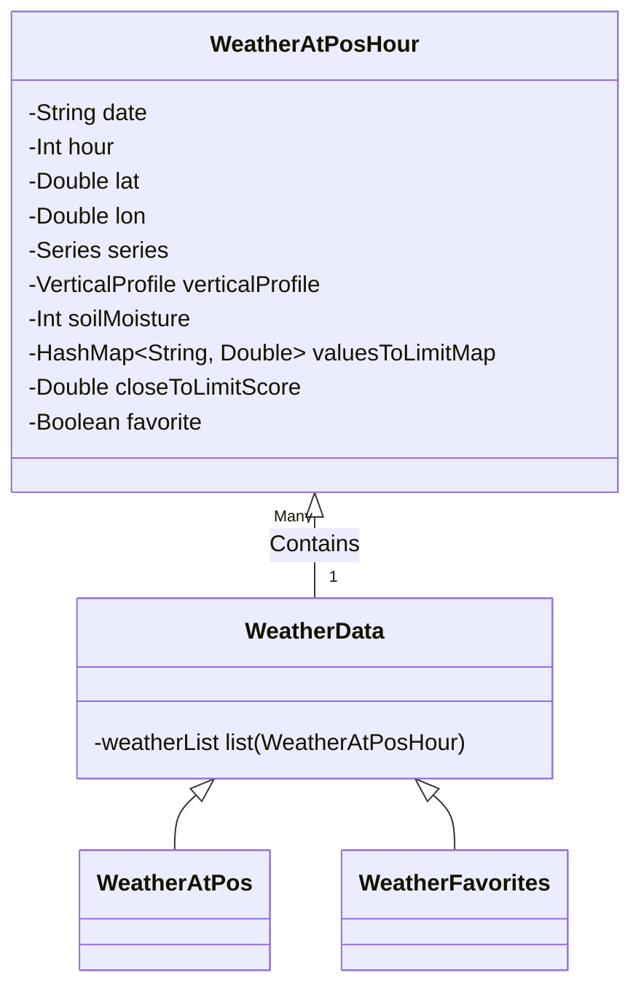
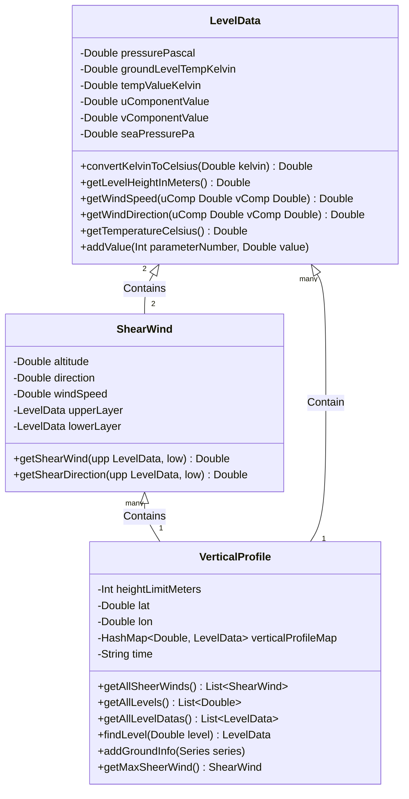
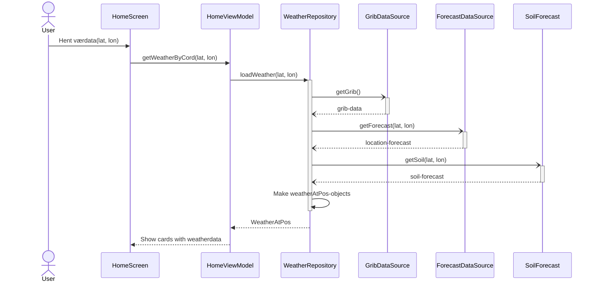
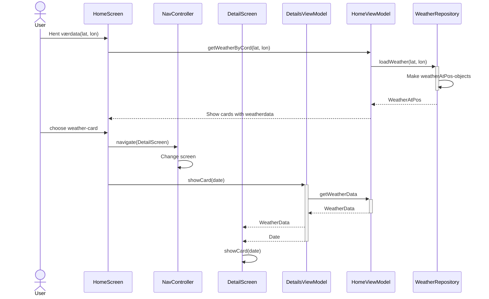
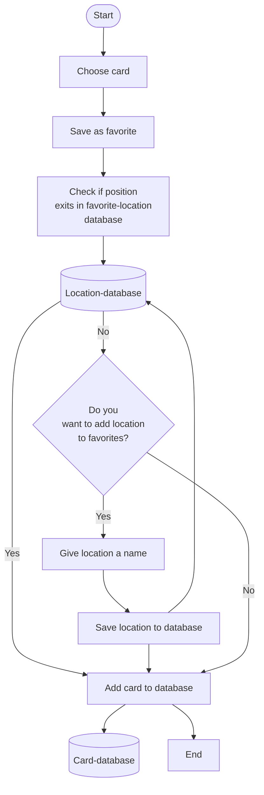
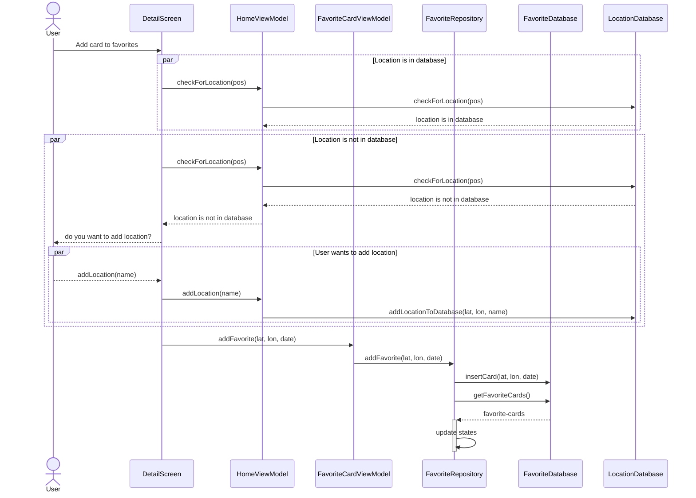

# Modelling

\
\
Klassestruktur for lagring av værdata

\
\
Klassestruktur for VerticalProfile

\
\
Sekvensdiagram for at bruker trykker "Get Weatherdata"

\
\
Sekvensdiagram for at bruker velger et værkort

\
\
Flytdiagram

\
\
Sekvensdiagram

