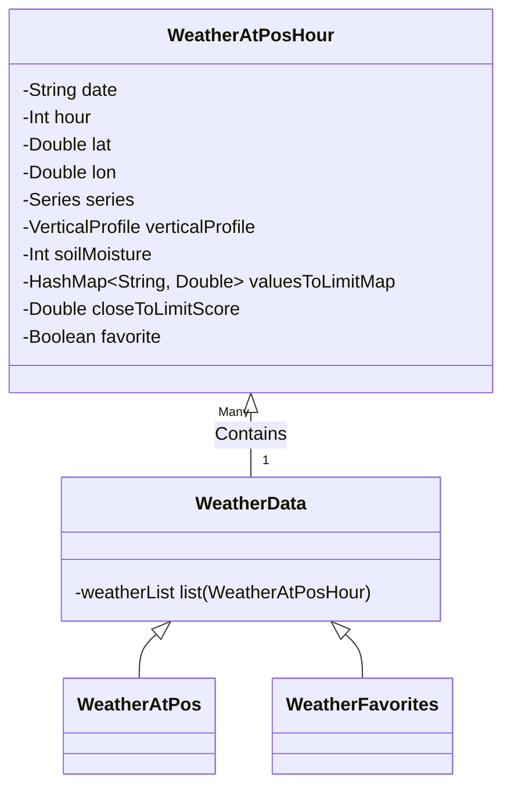
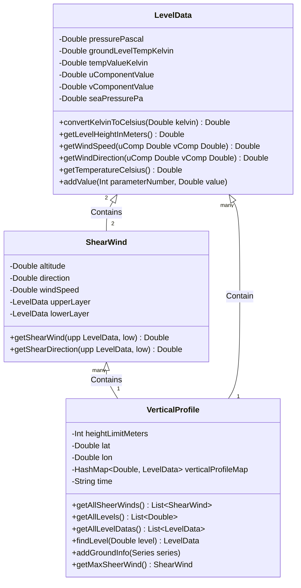
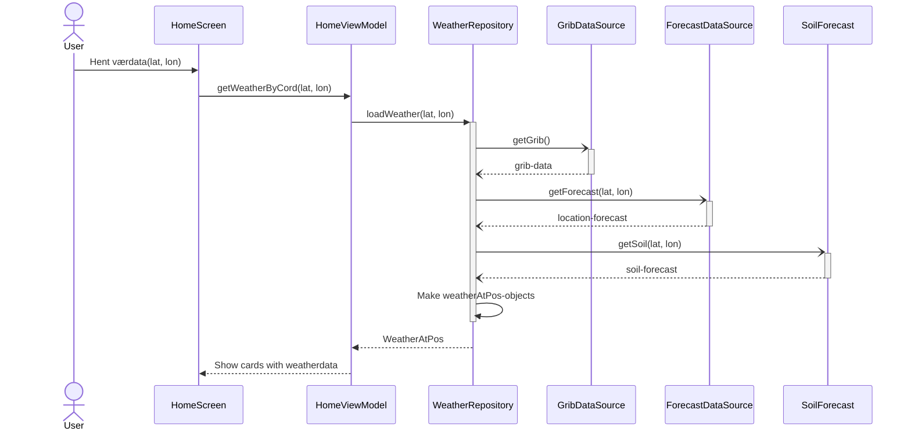
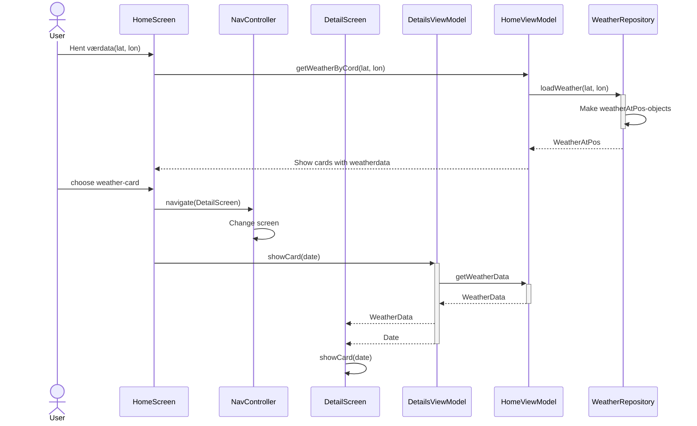
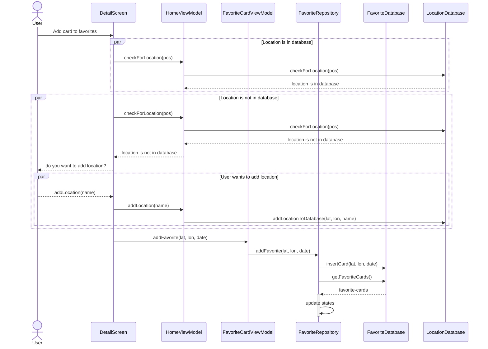
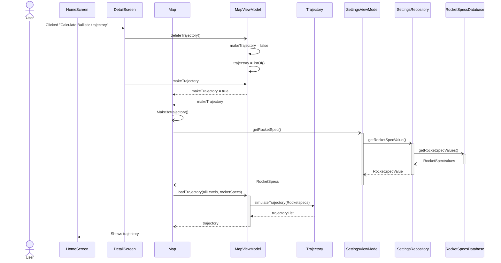
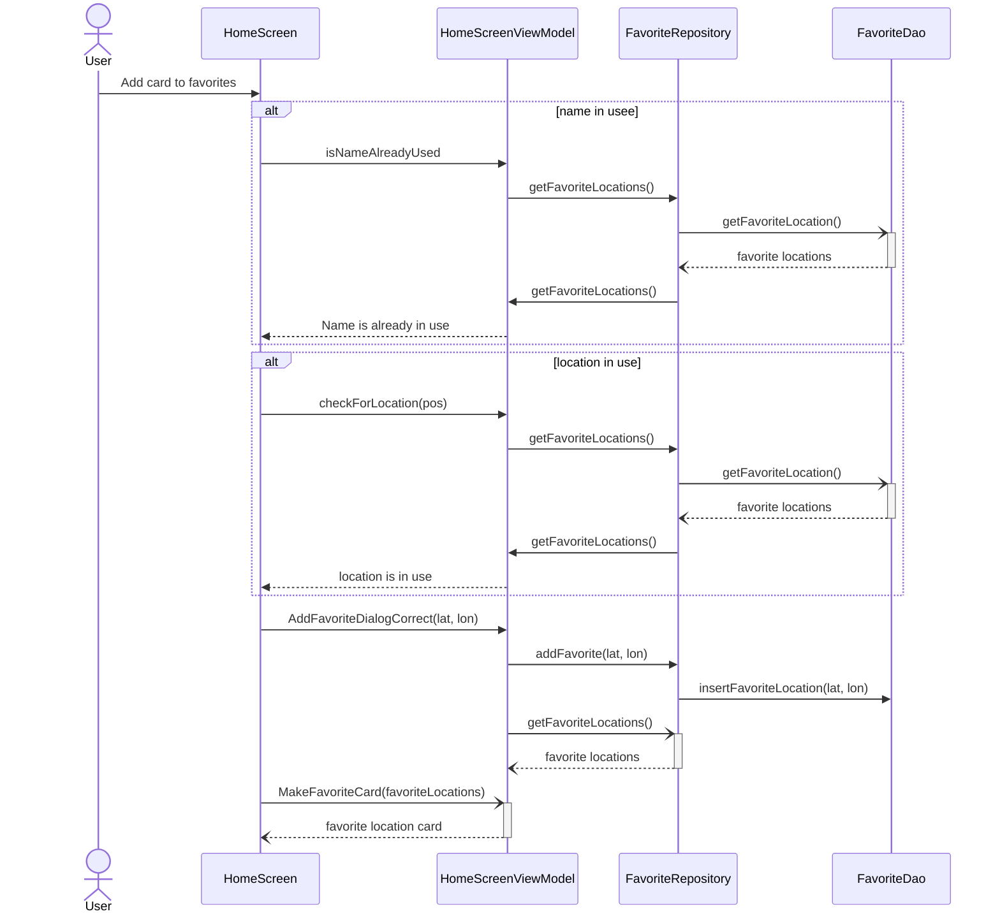
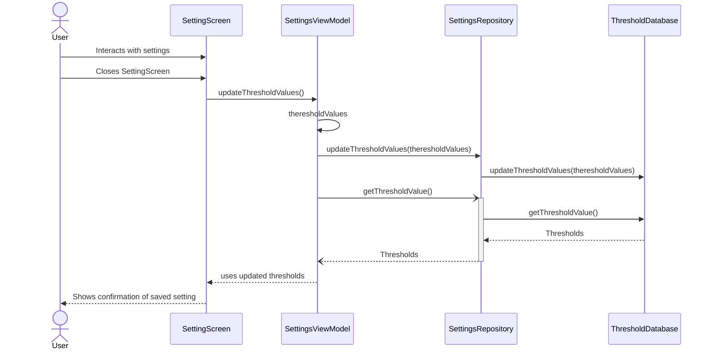
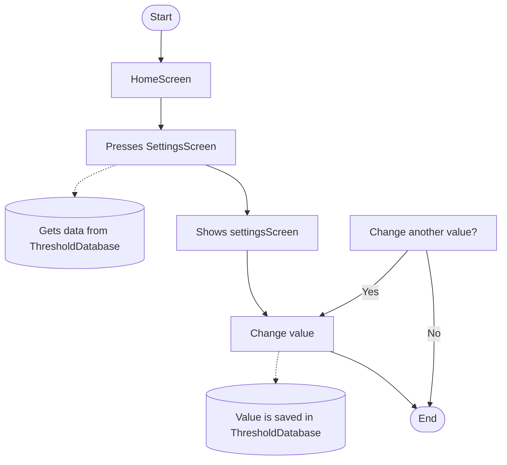
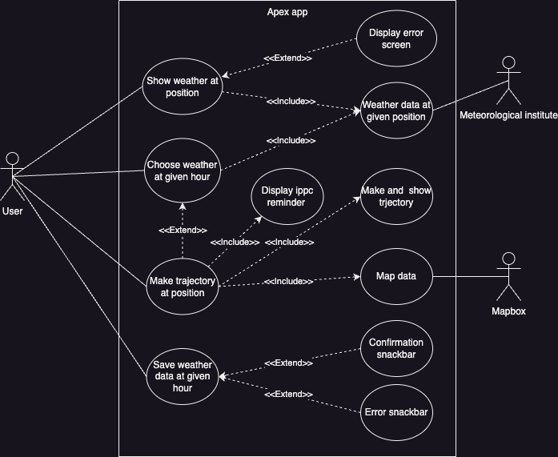

# Modelling
\
\
Class structure -> For storing weather data:

Textual description: “I want to view weather data for a point on the map that I select, to determine if its safe to launch a rocket at that time”

\
\
Class structure -> For VerticalProfile:

Textual description: “I want to view weather data for a point on the map that I select, to determine if its safe to launch a rocket at that time”

\
\
SequenceDiagram -> When user clicks "Get Weatherdata":

Textual description: “I want to view weather data for a point on the map that I select, to determine if its safe to launch a rocket at that time”

\
\
SequenceDiagram -> When user selects a weather-card:

Textual description: “I want  a clear overview of wind and shear wind, speed, and direction, ground moisture, temperature, percipitation, fog, dew point, cloud coverage and visibility as these are critical weather data for rocket launchese”

\
\
Flowchart -> When user saves a weather-card at a specific time:

Textual description: “I want to be able to save a timestamp in the app so that i can quickly retrive weather details for a secific location at a specific time.”

\
\
SequenceDiagram -> When user saves a weather-card at a specific time:

Textual description: “I want to be able to save a timestamp in the app so that i can quickly retrive weather details for a secific location at a specific time.”

\
\
SequenceDiagram -> The app should be able to calculate the ballistic trajeectory at a given time i choose:

Textual description: "I want to simulate the trajectory of my rocket to know where it will land"

Precondtition: The user has alredy selected a timestamp for a specific latitude and longitude

\
\
SequenceDiagram-> Add to favorites:

Textual description: “I want to be able to save a location in the app so that I can quickly revisit the launch site”

\
\
SequenceDiagram-> When user customizes the treshold values for weather data to their rocket:

Textual description: “I want to be able to adjust rocket values so that the app uses data specific to my rocket"

Precondition:User has alredy updated threshold values

\
\
Flowchart -> customizing threshold values for weather data:

Textual description: “I want to be able to adjust threshold values so that the app uses data tailored to my rocket”

## Use case
Use case of various user stories

Textual description: 
\
\
“I want to see weather data at a give position”
\
\
“I want to see the weather data at a specific hour”
\
\
“I want to see a predicted tracjetory on a given position”
\
\
“I want to save a weather data at a specific time and locaiton”
\
\

